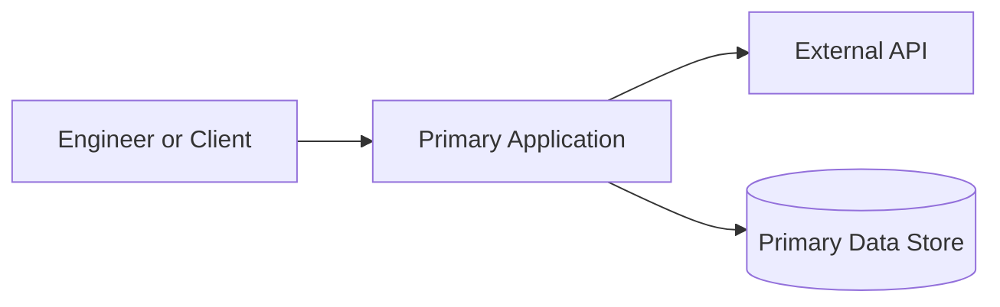
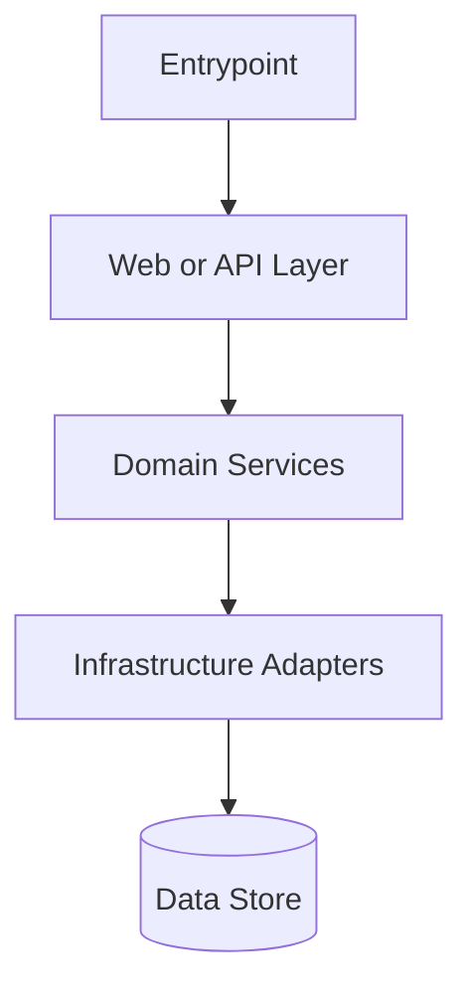
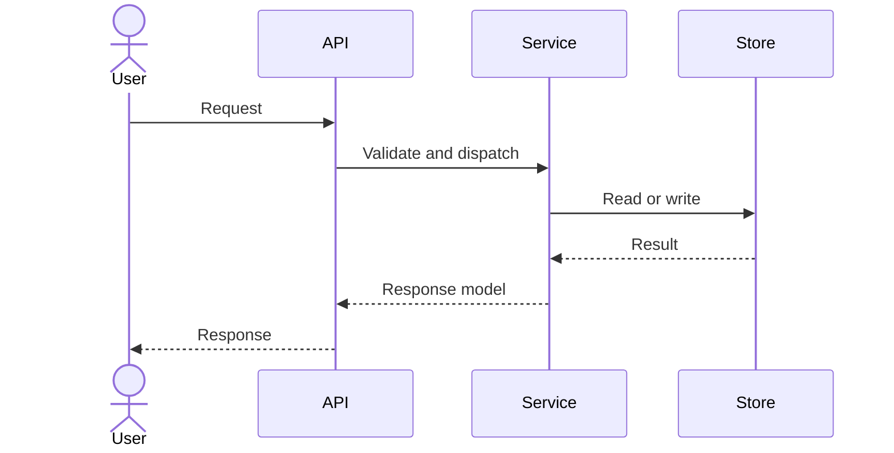

# Mermaid Diagram Patterns

## System Context

Use this when the onboarding question is: what does this repository talk to and where does it sit?

## Component Map

Use this when the onboarding question is: how is the repository internally organized?

## Sequence Flow

Use this when the onboarding question is: what happens in the important path?

## Diagram Caption Pattern
- What this diagram shows:
- The one boundary or handoff to notice first:
- What a new engineer should read next: